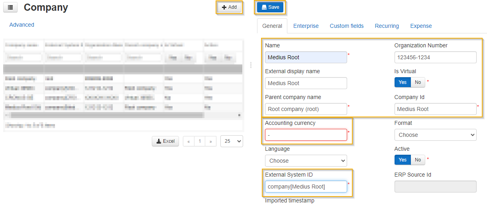

The very first step to get going with Medius is to add your organization(s) to the Medius company structure. The companies added to Medius should typically reflect your organization's legal entities and company codes in your ERP.

## Set the Company structure
It's important to setup a good company structure that reflects not only your legal entities but also reflects how the legal entities are organized.
Best practise guidelines for establishing the company structure is found on the Medius Success Portal here: [Company structure design guidelines](https://success.mediusflow.com/documentation/administration_guide/administration_pages/configuration_tutorials/company_structure/)

If you have many legal entities or a complex organization structure it is recommended to consult your implementation partner to build the organizational structure in Medius.

Company codes are added in Medius using this administration page: [Add companies here](https://cloud.mediusflow.com/$TenantNameQA/#/Administration/Medius.Core.Entities.Company)
When adding companies you have to fill in the accounting currency of each company. A new Medius deployment is preconfigured with the most common currency codes but if the currency code you need is missing from the list you can add it by following the below instruction.

The company configuration holds a lot of details and provides many possibilities. In this step we'll only add the basics. Detailed company configuration will be covered in other sections.
Guidance to all company configuration options in Medius can be found in this Success Portal section: [Success portal company configuration](https://success.mediusflow.com/documentation/administration_guide/administration_pages/company/)

### If currency code is missing
If any accounting currency code used by your legal entities is missing you need to add it manually before creating the companies. This is done by following below steps.
[Add currency codes here](https://cloud.mediusflow.com/$TenantNameQA/#/Administration/Medius.Core.Entities.Currency)

1. Click **Add**.
2. Enter currency ISO code (or currency code as found in ERP) in both *Currency* and *External System ID* fields.
3. Click **Save**.

### Add a virtual company node
The virtual company structure can be used to setup a scalable company model where master data and configuration is shared depending on needs. Below is the minimum level of virtual structure required in a NAV context. 
This should be extended in accordance with your company structure design.

Add a virtual company with company id V_NAVRoot below root. V_NAVRoot is the preferred company to do any changes that are common for all NAV companies. 
All the NAV companies that are created should have V_NAVRoot as parent to follow best practice. 

Property | Value | Comment
--- | --- | ---
**Name** | NAV Root | 
**Organization Number** | - | Not needed for virtual
**Is Virtual** | Yes | Must be virtual
**Accounting Currency** |  | Choose the currency code that applies to the majority of companies within this company group 
**External System ID** | company[V_NAVRoot] | Cannot be changed when saved
**ERP Id** | V_NAVRoot | Should be the same as External System ID

### Add your companies
Now add the company codes of your organization by repeating the below steps for each company code.

Property | Value | Comment
--- | --- | ---
**Name** | Company name in NAV | Must be the exact name as spelled in NAV.
**Organization Number** | - | Not mandatory, but nice to have
**Is Virtual** | No | No for all leaf companies
**Accounting Currency** |  | Cannot be changed after saving.
**External System ID** | company[NAVSE_01] | Use a descriptive name, i.e. NAVSE_01 for the first swedish NAV company.
**ERP Id** | NAVSE_01 | Should be the same as used for External System ID

The above needs to be set once per company, and it needs to match what is sent in the integration.

